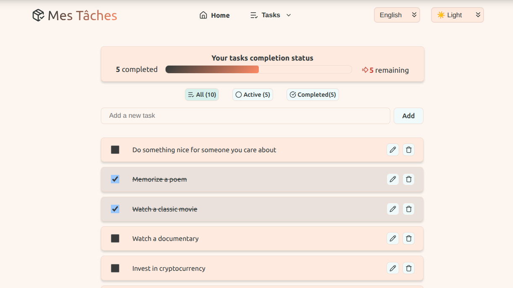
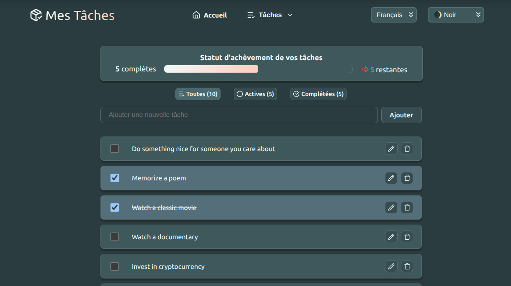

# ENSICAEN Front-End Development Project: React Todo List

### Site Link -> [Mes Tâches](https://todo-theta-rose.vercel.app/)

This project is a comprehensive "fil rouge" (long-running) assignment for the front-end development module at ENSICAEN. It is a feature-rich "Todo List" application built from scratch using React, Vite, and modern development tools.

This repository documents the work, architecture, and technical choices made by **Abraão De Carvalho Albuquerque** and **Paulo De Meneses**.

## ✨ Screenshots

Here is a preview of the application, demonstrating the light and dark mode themes.

|                             Light Mode                              |                             Dark Mode                             |
| :-----------------------------------------------------------------: | :---------------------------------------------------------------: |
|  |  |

## 🚀 Core Features

The application implements all the core features specified in the course module, including:

- **Full Task Management:** Create, read, edit, delete, and toggle task completion.
- **Centralized State:** Uses `useReducer` and `useContext` for efficient, prop-drilling-free global state management.
- **API Integration:** Asynchronously fetches initial tasks from the `dummyjson.com` API using a custom `useTodoApi` hook.
- **Internationalization (i18n):** Full language support for **English (en)** and **French (fr)** using **LinguiJS**.
- **Client-Side Routing:** Multi-page navigation (e.g., "Tasks" vs. "Archived Tasks") handled by **React Router**.
- **Advanced Accessibility (a11y):** Full keyboard navigation for the header and dropdown menus, adhering to ARIA patterns.
- **Modern UI/UX:**
  - Light/Dark mode theme switching.
  - Task filtering (All, Active, Completed).
  - User notifications for API errors and actions via `react-hot-toast`.
  - Clean, icon-driven interface using `lucide-react`.

---

## 🛠️ Tech Stack & Design Choices

This section explains _why_ we chose specific technologies and patterns to build this project.

### 1. Core Framework

- **React:** The required library for the project. We used functional components and hooks for all logic.
- **Vite:** Chosen as our build tool and development server. Its speed (leveraging native ES modules) provided an excellent development experience with near-instant Hot Module Replacement (HMR).

### 2. State & Data Management

- **React Context & `useReducer`:** As per the assignment, we opted for React's built-in state management tools. This combination is powerful:
  - `useReducer` handles complex state logic (like adding, updating, and filtering todos) in a single, predictable function.
  - `useContext` provides this state and its `dispatch` function to any component in the tree, completely eliminating prop drilling.
- **Custom Hook (`useTodoApi`):** We encapsulated all API-related logic (fetching, loading states, error handling) into its own hook. This follows the principle of **Separation of Concerns**, keeping our components clean and making data-fetching logic reusable and testable.

### 3. Navigation & Internationalization

- **React Router:** The standard for routing in React. We specifically used `HashRouter` (as seen in `main.jsx` from the instructions) to meet the assignment's constraint of deploying to GitLab Pages, which doesn't support the History API used by `BrowserRouter` without server-side configuration.
- **LinguiJS:** We chose Lingui for internationalization (i18n) over other libraries because:
  - It's powerful and lightweight.
  - It uses the industry-standard **gettext** format (`.po` files), which is familiar to translators.
  - Its combination of the `<Trans>` component and `useLingui` hook makes it simple to manage static text and dynamic values (like pluralization for "5 tasks remaining").
  - The setup (seen in `lingui.config.js` and `vite.config.js`) integrates cleanly with Vite.

### 4. UI & Styling

- **Lucide-react:** We selected this icon library for its simplicity, consistency, and small bundle size (it's tree-shakable).
- **react-hot-toast:** A simple, non-intrusive library for providing users with feedback (e.g., "Task added," "API Error").

### 5. Code Quality & DevOps

This was a major focus for our group. We wanted to ensure a professional development workflow.

- **ESLint & Prettier:** We configured a strict ruleset (see `eslint.config.js`) to enforce a single, consistent code style and catch bugs before they were committed.
- **Husky (Git Hooks):** We used Husky to automate our quality checks.
- **Commitizen & `commitlint`:** We enforced **Conventional Commits** (e.g., `feat:`, `fix:`, `docs:`). This makes the Git history clean, readable, and enables automatic changelog generation.
- **GitLab CI (`.gitlab-ci.yml`):** We configured a CI pipeline that runs on every merge request. This pipeline automatically runs three checks:
  1.  `prettier:check` (checks formatting)
  2.  `eslint:check` (checks for code errors)
  3.  `commitlint` (checks that all commit messages in the MR follow the conventional standard)

This CI setup ensures that no low-quality code is ever merged into the main branch.

---

## 📦 Local Setup

### Prerequisites

- Node.js (v22.x or higher)
- Yarn (or npm)

### Installation

1.  Clone the repository:
    ```bash
    git clone https://gitlab.ecole.ensicaen.fr/de-carvalho-albuquerque/dev-web-project
    cd dev-web-project
    ```
2.  Install dependencies:
    ```bash
    yarn install
    ```

### Running the Project

1.  Start the development server:
    ```bash
    yarn dev
    ```
    The application will be available at `http://localhost:5173`.

### Useful Scripts

- **Linting & Formatting:**

  ```bash
  # Check for ESLint errors
  yarn lint:eslint:check

  # Check for Prettier formatting errors
  yarn lint:prettier:check

  # Automatically fix Prettier errors
  yarn lint:prettier:fix
  ```

- **Internationalization (i18n):**

  ```bash
  # Extract new translatable messages from code
  yarn extract

  # Compile .po files into message catalogs
  yarn compile
  ```

---

## 🧑‍💻 Authors

- **Abraão de Carvalho Albuquerque** - [GitHub](https://github.com/abrxao)
- **Paulo De Meneses** - [Github](https://github.com/pauloDiego-sudo)
